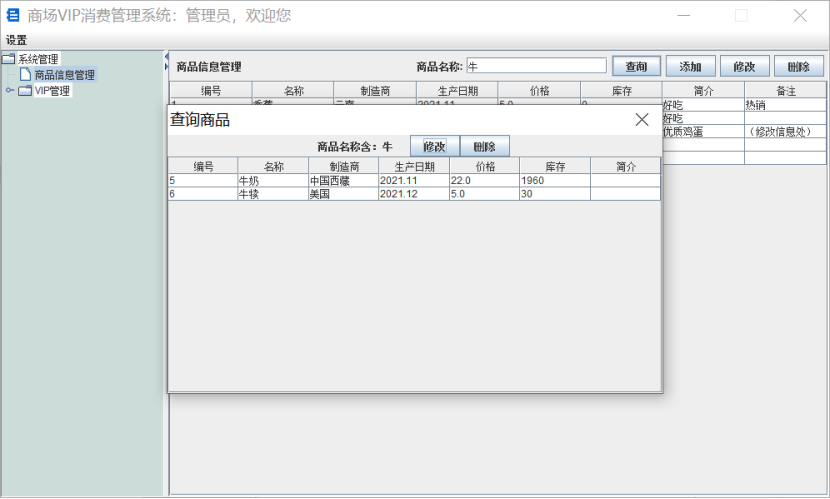

# TheSystemOfShopingVIPManagement

## 商场VIP消费管理系统

### 1.使用到的技术：

### 		Javaswing、Mysql、Druid、JdbcTemplate

### 2.运行项目步骤：
        1、在mysql中创建shoppingvipmanagesystem数据库
        2、导入SQL文件夹下的文件
        3、修改项目中Druid.properties文件中的数据库信息
        4、idea打开项目，找到src/GUI/MainInterface文件，运行main方法
### 3.登录系统：
    用户名：admin
    密码：123

## 系统界面设计
 

## 主程序的设计

运行程序后，首先弹出登录页面，管理员登录成功后，登录页面消失，展现出主管理页面。

主管理页面最上面一栏为菜单栏，可以进行“注销账户”、“帮助”、“退出系统”操作。菜单栏下方为主管理页面主体，主体分为两部分，左边一部分为树形结构的选项列，右边一部分将根据管理员点击的树形结点，展现出对应的管理页面，如点击“商品信息管理”，则右边将展示商品信息管理页面。主页面右部分展现的所有管理页面，都是独立的类，使管理主页面类中的代码结构清晰。在需要展现哪个管理页面时，在主页面右部分初始化调用相应的类并使其可视化即可展现。

在各独立的管理页面中，分为上下两部分，上面一栏为工具栏，有若干按钮，可以对下面的信息表格进行操作。由于表格上方有“添加”、“删除”、“查询”按钮，除了“删除”按钮以外，其他所有按钮被点击后都需要弹出对话框辅助管理员完成相应功能，而每个弹出的对话框，都设置成独立于该管理页面类的组件类，继承JDialog类。使得每个管理页面结构清晰。

以上为该程序的主要结构设计思路，在该思路下，所有类的代码结构都十分清晰简洁。

## 类的设计

1、与调用数据库相关的类

  (1)JDBC:使用Druid连接池技术

  (2)Dao: 使用JdbcTemplate操作数据库

  (1)CommodityDao：连接商品信息表

  (2)VIPDao：连接VIP信息表

  (3)ShoppingRecordDao：连接消费订单记录表

2、JavaBean类

按照JavaBean要求构建，方便在数据库中查询到数据后封装成对象类返回

（1）CommodityBean

（2）VIPBean

（3）ShoppingRecordBean

3、GUI界面类

（1）MainInterface：登录页面

（2）MangerInterface：主管理页面

（3）HelpComponent：帮助界面

4、商品信息管理：

（3）CommodityManageComponent：商品信息管理页面

（4）AddCommodity：添加商品对话框

（5）SearchCommodity：查询商品对话框

（6）UpdateCommodity:修改商品对话框

5、VIP信息管理：

（1）VIPInformationComponent:VIP信息管理页面

（2）AddVIP：添加VIP对话框

（3）SearchVIP：查询VIP对话框

（4）UpdateVIP：修改VIP信息对话框

6、消费订单管理：

（1）ShoppingRecordComponent：消费订单管理页面

（2）AddRecord:添加订单对话框

（3）SearchRecord：查询订单对话框

（4）UpdateRecord：修改订单信息对话框

7、工具类

（1）BackGroundPanel:给容器添加背景装饰图

（2）ScreenUtils：获取电脑屏幕的长和宽，使弹出窗口居中

